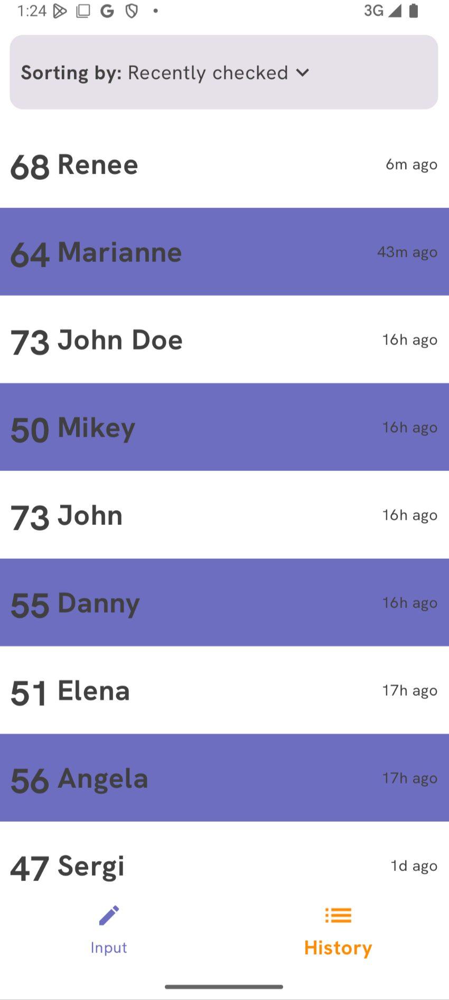
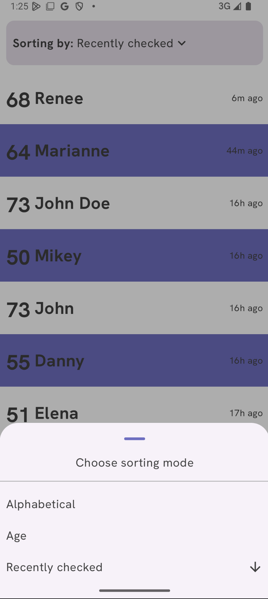
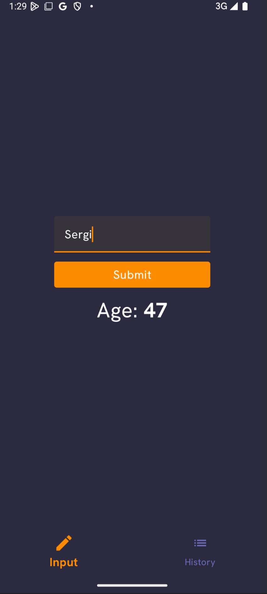
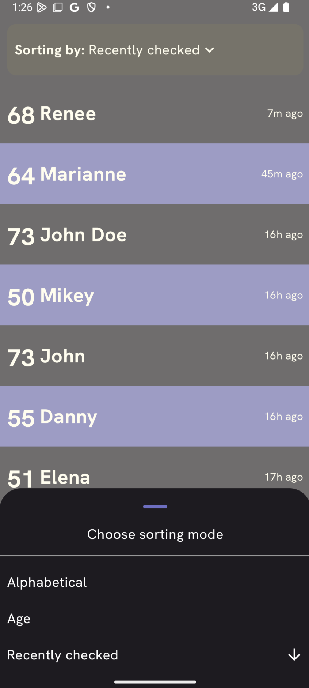

# Human Profiler App

## Overview

This application is a take-home assignment developed for a job position at PostNL. It demonstrates my skills in Android development using Jetpack Compose and modern architectural patterns.

The Human Profiler app is designed to fetch and display guessed user ages based on their names. It showcases my ability to:

- Build a user-friendly interface with Jetpack Compose.
- Implement clean architecture principles for code organization and maintainability.
- Handle asynchronous operations and error handling.
- Integrate with external and local data sources.

## How to Use

1. **Enter a Name:** On the main screen, you'll find a text field where you can enter the name of the person whose age you want the app to guess.
2. **Tap "Submit":** After entering the name, tap the "Submit" button.
3. **View the Profile:** If a profile is found for the given name, its age will be displayed on the screen.
4. **Handle Errors:** If there's an error (e.g., network issue, invalid name), an appropriate message will be shown to the user.
5. **View Profiles:** On the bottom navigation bar you can tap on the "History" button to see all the profiles you have previously checked.
6. **Sort Profiles:** You can sort the list of previously viewed profiles by name, age, or date of checking. Tap the sorting options to change the order.

## Screenshots

The following screenshots capture the user flow as explained in the previous section both in light and in dark mode. This showcases the UI flexibility of the application.

|              Input Screen               |              History Screen               | Sorting the history                        |
|:---------------------------------------:|:-----------------------------------------:|:-------------------------------------------|
|  |  |  |
|   |   |   |